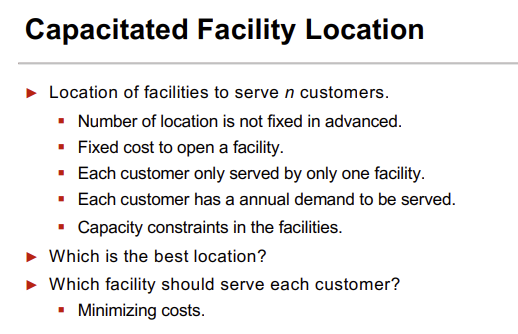

# Mazais praktiskais darbs kombinatoriskajā optimizācijā
## Capacitated Facility Location
Kods rakstīts valodā Kotlin un būvēts ar Gradle.
```gradlew run```
```gradlew test```

### 1. Uzdevuma formulējums
Uzdevuma formulējums ņemts no: https://www.upf.edu/documents/3186295/0/Combinatorial+Optimization+Problems/0bbbfc98-dbc9-2e38-802b-499b9347ad1b





Uzdevums ir definēts tā, ka ir **n** ražotāji *retailers* un **m** potenciālās noliktavas *warehouse*.
Ražotājiem ir pieprasījums *demand*, noliktavam ir kapacitāte *capacity*. Papildus ir izmaksas noliktavas izmantošanai (vienreizējas būvniecības izmaksas).
Kā arī transportēšanas izmaksas no **n** uz **m** par katru vienību. Kā arī vienu ražotāju var apkalpot tikai viena noliktava.

Optimizācijas uzdevums ir atrast labākas noliktavas, kurām apkalpot klientus nepārsniedzot noliktavu
kapacitāti un minimizēt transportēšanas izmaksas.

Risinājums ir sapārojums ražotājs -> noliktava.<br>
Risinājums piemērs:
```
Warehouse capacity exceeded: false
Cost: 6620
Warehouses used [WH1, WH2, WH3] 
(Retailer:Warehouse) mapping: 
(Retailer1 [80] -4-> WH1 [500])
(Retailer2 [270] -5-> WH1 [500])
(Retailer3 [250] -3-> WH2 [500])
(Retailer4 [160] -3-> WH3 [500])
(Retailer5 [180] -4-> WH3 [500])
```

Programmas ieejas dati tiek uzdoti JSON formātā:
```
{
  "retailers": [
    { "name": "Retailer1", "demand": 80 },
    { "name": "Retailer2", "demand": 270 },
    { "name": "Retailer3", "demand": 250 },
    { "name": "Retailer4", "demand": 160 },
    { "name": "Retailer5", "demand": 180 }
  ],
  "potential_warehouse_sites": [
    { "name":  "WH1", "capacity": 500, "cost": 1000 },
    { "name":  "WH2", "capacity": 500, "cost": 1000 },
    { "name":  "WH3", "capacity": 500, "cost": 1000 }
  ],
  "transportation_cost_matrix": [
    [4, 5, 6, 8, 10],
    [6, 4, 3, 5, 8],
    [9, 7, 4, 3, 4]
  ]
}
```

Optimizācijas uzdevums minimizēt izmaksas, kas sastāv no transportēšanas izmaksu summas + noliktavas atvēršanas izmaksām.

Papildus ir **cietie** nosacījumi:
1. Klientu pieprasījums nedrikst pārsniegt konkrētās noliktavas kapacitāti.
2. Vienu ražotāju apkalpo tieši viena noliktava.
3. Noliktava ir atvērta, ja ir vismaz viens ražotājs, kas to izmanto.


### 2. Algoritma apraksts (Late Acceptance Hill Climbing)
Risinājuma meklēšanai tiek izmantots domēna-neatkarīgs *Late Acceptance Hill Climbing* algoritms.

Algoritms implementēts pēc lekciju slaidu piemēra. Tā ideja ir turēt atminā pēdējās **n** izmaksu vērtības un akceptēt risinājumu,
ja tas ir labāks par pirms **n** soļiem redzētā risinājuma, kas ļauj algoritmam parametriksi **n** veikt apkārtnes apceļošanu nevis katrā brīdi akceptēt labāku risinājumu.

Algoritms un izmaksu funkcija tiek implementētas Solver klasē [Solver.kt](https://github.com/artursstaf/capacitated-facility-location/blob/master/src/main/kotlin/Solver.kt).
Optimizācijas algoritms saņem problēmas definīciju kā Model klases instanci [Model.kt](https://github.com/artursstaf/capacitated-facility-location/blob/master/src/main/kotlin/Model.kt)
, **n** *Late Acceptance Hill Climbing* parametru, kas glabā **n**  (default 50) pēdējās izmaksu vērtības,
kā arī **earlyStopping** (default 10_000) parametru, kas pasaka pēc cik algoritma iterācijām jāapstājas, ja netiek atrasts labāks risinājums.

#### 2.1. Risinājums
Risinājums ir uzdots kā Retailer:Warehouse vārdnīca, kura tiek inicializēta ražotājiem piekārtojot nejaušas noliktavas.<br>
```private var solution: Map<Retailer, Warehouse> = model.retailers.associateWith { model.warehouses.random() }.toMutableMap()```

####  2.2. Apkārtnes funkcija
Izvēlas nejaušu ražotāju un piekārto tam citu nejaušu noliktavu.
```
private fun step(): MutableMap<Retailer, Warehouse> {
    val newSolution = solution.toMutableMap()

    val (retailer, warehouse) = solution.entries.random()
    val randomWarehouse = model.warehouses.minus(warehouse).random()
    newSolution[retailer] = randomWarehouse

    return newSolution
}
```

#### 2.3. Izmaksu funkcija
Sastāv no 3 daļām. 2 mīkstajiem nosacījumiem un 1 cietā nosacījuma.
1. Noliktavas izmantošanas/aktivizēžanas/būvniecības izmaksām.
2. Transportēšanas izmaksām.
3. Noliktavas kapacitātes nepārsniegšana **cietais** (tiek pareizināts ar lielu konstanti - tā, lai tas pārsver iepriekšējo izmaksu summas).
```
private fun calculateCost(solution: Map<Retailer, Warehouse>) =
    // Activation costs for activated warehouses (soft)
    solution.values.toSet().sumOf { it.activationCost } +
            // Transportation costs (soft)
            solution.entries.sumOf { (retailer, warehouse) -> warehouse.transportationCost[retailer]!! * retailer.demand } +
            // Warehouse capacity exceeded
            HARD_CONSTRAINT_MULTIPLIER * solution.values.toSet().map { warehouse ->
        if (warehouse.capacity < solution.entries.filter { it.value == warehouse }.sumOf { it.key.demand }) 1 else 0
    }.sum()
```

### 3. Testēšanas apraksts
Testa piemēri tiek definēti iekš [SolutionTests.kt](https://github.com/artursstaf/capacitated-facility-location/blob/master/src/test/kotlin/SolutionTests.kt),
ieejas dati [resources](https://github.com/artursstaf/capacitated-facility-location/blob/master/src/test/resources).

1. testConvergeLowerWarehouseCost
   1. Transportēšanas izmaksas vienādas, kapacitāte pietiekami liela.
   2. Pārbauda vai konverģē uz to noliktavu kur mazākās būvniecības izmaksas.
   3. Izpilde.
```
{
  "retailers": [
    { "name": "Retailer1", "demand": 80 },
    { "name": "Retailer2", "demand": 270 },
    { "name": "Retailer3", "demand": 250 },
    { "name": "Retailer4", "demand": 160 },
    { "name": "Retailer5", "demand": 180 }
  ],
  "potential_warehouse_sites": [
    { "name":  "WH1", "capacity": 500, "cost": 1001 },
    { "name":  "WH2", "capacity": 1000000, "cost": 1000 },
    { "name":  "WH3", "capacity": 500, "cost": 1001 }
  ],
  "transportation_cost_matrix": [
    [2, 2, 2, 2, 2],
    [2, 2, 2, 2, 2],
    [2, 2, 2, 2, 2]
  ]
}
```
```Found better solution after 2 steps, Best Cost: 4882
Found better solution after 6 steps, Best Cost: 3881
Found better solution after 8 steps, Best Cost: 2880
Optimization stopped
Warehouse capacity exceeded: false
Cost: 2880
Warehouses used [WH2]
(Retailer:Warehouse) mapping:
(Retailer1 [80] -2-> WH2 [1000000])
(Retailer2 [270] -2-> WH2 [1000000])
(Retailer3 [250] -2-> WH2 [1000000])
(Retailer4 [160] -2-> WH2 [1000000])
(Retailer5 [180] -2-> WH2 [1000000])
Execution time 0.774s
```

2. testConvergeLowerTransportationCost
    1. Kapacitāte pietiekami liela, būvniecības izmaksas lielas.
    2. Pārbauda vai konverģē uz ceļiem, kur transportēšanas izmaksas mazākās.
    3. Izpilde.
```
{
  "retailers": [
    { "name": "Retailer1", "demand": 80 },
    { "name": "Retailer2", "demand": 270 },
    { "name": "Retailer3", "demand": 250 },
    { "name": "Retailer4", "demand": 160 },
    { "name": "Retailer5", "demand": 180 }
  ],
  "potential_warehouse_sites": [
    { "name":  "WH1", "capacity": 1000000, "cost": 1000 },
    { "name":  "WH2", "capacity": 1000000, "cost": 1000 },
    { "name":  "WH3", "capacity": 1000000, "cost": 1000 }
  ],
  "transportation_cost_matrix": [
    [2, 2, 2, 2, 2],
    [2, 2, 2, 2, 2],
    [1, 1, 1, 1, 1]
  ]
}
```
```
Warehouse capacity exceeded: false
Cost: 1940
Warehouses used [WH3] 
(Retailer:Warehouse) mapping: 
(Retailer1 [80] -1-> WH3 [1000000])
(Retailer2 [270] -1-> WH3 [1000000])
(Retailer3 [250] -1-> WH3 [1000000])
(Retailer4 [160] -1-> WH3 [1000000])
(Retailer5 [180] -1-> WH3 [1000000])
Execution time 0.793s
```

3. testDoesNotExceedWarehouseCapacity
    1. Būvniecības izmaksas vienādas, transportēšanas izmaksas nejaušas
    2. Pārbauda vai konvērģē uz to noliktavu, kurai pietiekama kapacitāte
    3. Izpilde.
```
{
  "retailers": [
    { "name": "Retailer1", "demand": 80 },
    { "name": "Retailer2", "demand": 270 },
    { "name": "Retailer3", "demand": 250 },
    { "name": "Retailer4", "demand": 160 },
    { "name": "Retailer5", "demand": 180 }
  ],
  "potential_warehouse_sites": [
    { "name":  "WH1", "capacity": 5, "cost": 1000 },
    { "name":  "WH2", "capacity": 100000, "cost": 1000 },
    { "name":  "WH3", "capacity": 5, "cost": 1000 },
    { "name":  "WH4", "capacity": 5, "cost": 1000 },
    { "name":  "WH5", "capacity": 5, "cost": 1000 },
    { "name":  "WH6", "capacity": 5, "cost": 1000 }
  ],
  "transportation_cost_matrix": [
    [4, 5, 6, 8, 10],
    [6, 4, 3, 5, 8],
    [9, 7, 4, 3, 4],
    [9, 7, 4, 3, 4],
    [9, 7, 4, 3, 4],
    [9, 7, 4, 3, 4]
  ]
}
```
```
Warehouse capacity exceeded: false
Cost: 5550
Warehouses used [WH2] 
(Retailer:Warehouse) mapping: 
(Retailer1 [80] -6-> WH2 [100000])
(Retailer2 [270] -4-> WH2 [100000])
(Retailer3 [250] -3-> WH2 [100000])
(Retailer4 [160] -5-> WH2 [100000])
(Retailer5 [180] -8-> WH2 [100000])
Execution time 0.887s
```

4. testBasic
    1. Dažādu izmaksu kombinācija
    2. Pārbauda vai konvērģē uz risinājumu, kur optimālas kombinētās izmaksas
    3. Izpilde.
```
{
  "retailers": [
    { "name": "Retailer1", "demand": 80 },
    { "name": "Retailer2", "demand": 270 },
    { "name": "Retailer3", "demand": 250 },
    { "name": "Retailer4", "demand": 160 },
    { "name": "Retailer5", "demand": 180 }
  ],
  "potential_warehouse_sites": [
    { "name":  "WH1", "capacity": 500, "cost": 1000 },
    { "name":  "WH2", "capacity": 500, "cost": 1000 },
    { "name":  "WH3", "capacity": 500, "cost": 1000 }
  ],
  "transportation_cost_matrix": [
    [4, 5, 6, 8, 10],
    [6, 4, 3, 5, 8],
    [9, 7, 4, 3, 4]
  ]
}
```
```
Warehouse capacity exceeded: false
Cost: 6620
Warehouses used [WH1, WH2, WH3] 
(Retailer:Warehouse) mapping: 
(Retailer1 [80] -4-> WH1 [500])
(Retailer2 [270] -5-> WH1 [500])
(Retailer3 [250] -3-> WH2 [500])
(Retailer4 [160] -3-> WH3 [500])
(Retailer5 [180] -4-> WH3 [500])
Execution time 0.773s
```
4. testBig
    1. Lielu ievaddatu tests 100 ražotāji 100 noliktavas
    2. Nejauši ģenerēti ievaddati
    3. n=50, earlyStopping=500000
    4. Izpilde.
```
{
    "retailers": [{"name": "Retailer0", "demand": 94}, {"name": "Retailer1", "demand": 106}, {"name": "Retailer2", "demand": 57}, {"name": "Retailer3", "demand": 52}, .......
    "potential_warehouse_sites":[{"name": "WH0", "capacity": 2292, "cost": 1000}, {"name": "WH1", "capacity": 2925, "cost": 1000}, {"name": "WH2", "capacity": 3736, .......
    "transportation_cost_matrix": [[5, 10, 6, 5, 1, 8, 2, 1, 2, 3, 1, 9, 6, 4, 4, 1, 5, 7, 2, 10, 9, 3, 3, 3, 7, 3, 4, 2, .......
}
```
```
Warehouse capacity exceeded: false
Cost: 96948
Warehouses used [WH35, WH45, WH19, WH52, WH49, WH12, WH71, WH26, WH64 ....
(Retailer:Warehouse) mapping: 
(Retailer0 [94] -2-> WH35 [2833])
(Retailer1 [106] -10-> WH45 [2791])
(Retailer2 [57] -1-> WH19 [2518])
(Retailer3 [52] -5-> WH52 [3990])
(Retailer4 [187] -4-> WH49 [2358])
....
Execution time 307.589s
```